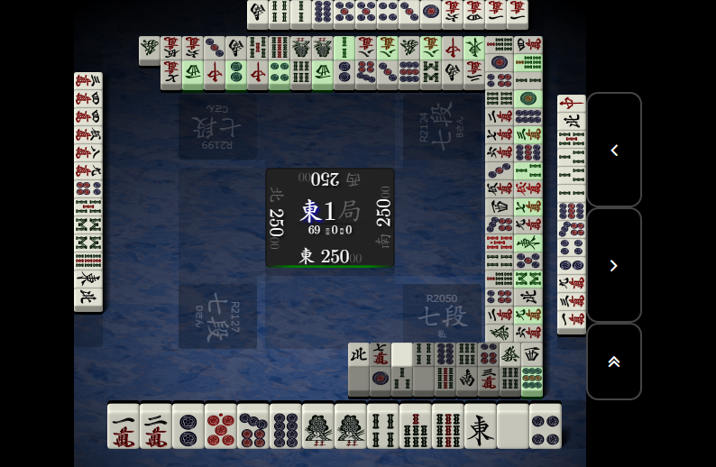

# TenhouTileWall
天鳳牌譜から牌山を生成する

## 参考にしたサイト
- 天鳳における牌山生成について
  - [牌山生成の公開方法: 天鳳ブログ](http://blog.tenhou.net/article/30503297.html)
  - [牌山生成方法の検証用データ](http://blog.tenhou.net/article/174202532.html)
  - [天鳳牌山生成アルゴリズムの安全性についてのメモ - integral001](http://integral001.blog.fc2.com/blog-entry-29.html)
  - [牌山生成検証コード(完成) - integral001](http://integral001.blog.fc2.com/blog-entry-42.html)
- Base64について
  - [Base64 - Wikipedia](https://ja.wikipedia.org/wiki/Base64)
  - [Unofficial mirror of sourceforce libb64 repository](https://github.com/transmission/libb64)
- エンディアン変換について
  - [C++で書くendian変換 - I.S.の日記](http://d.hatena.ne.jp/i_s/20100101/1262378598)
- MTについて
  - [mt19937ar: Mersenne Twister with improved initialization](http://www.math.sci.hiroshima-u.ac.jp/~m-mat/MT/MT2002/mt19937ar.html)
- SHA512(SHA256)について
  - [C言語OpenSSLでSHA256ハッシュ計算 | blog@kenzauros.com](http://kenzauros.com/blog/compute-sha256-with-openssl/)

## 動作環境
このリポジトリには32bit Linuxと64bit Linuxに対して、それぞれの環境で動作する牌山生成プログラムのソースファイル(gen32.cpp, gen64.cpp)が含まれます。これらのプログラムは以下の環境で正常に動作することが確認されています。

|ソースファイル|OS|プロセッサ|コンパイラ|バイトオーダー|
|:--|:--|:--|:--|:--|
|gen32.cpp|Fedora 29|32bit|GCC|リトルエンディアン|
|gen64.cpp|Ubuntu 18.04|64bit|GCC|リトルエンディアン|

ソースファイルの違いは整数型のサイズがOSやコンパイラによって異なることによるものです([difference between gcc and vc](http://herumi.in.coocan.jp/prog/gcc-and-vc.html#INTEGER_TYPE))。

## 必要なライブラリと入手方法
- libb64 (Base64デコード用)
  - Ubuntu 18.04の場合
~~~
$ sudo apt-get install libb64-dev
~~~
  - Fedora 29の場合
~~~
$ sudo dnf install libb64-devel
~~~
- OpenSSH (ハッシュ計算用)
  - Ubuntu 18.04の場合
~~~
$ sudo apt-get install openssl
~~~
  - Fedora 29の場合
~~~
$ sudo dnf install openssl
~~~
- mt19937ar (乱数生成用)
~~~
$ wget http://www.math.sci.hiroshima-u.ac.jp/~m-mat/MT/MT2002/CODES/mt19937ar.sep.tgz
$ tar -xzvf mt19937ar.sep.tgz
~~~

# 使用方法
以下の牌譜の牌山を再現します。

http://tenhou.net/0/?log=2017020100gm-00e1-0000-17d39cdb

1. ビルド

~~~
$ make [gen32.out|gen64.out]
~~~

2. 実行

~~~
$ ./[gen32.out|gen64.out]
--------Game 0--------
yama =
<白><北><1p><7m><3s><白><白><4s><9s><8p><南><6s><3m><6p><6s><發><9p>
<西><6m><發><9m><2m><北><6p><8s><7s><5p><4s><東><5s><9m><7p><7m><西>
<5m><5m><3s><3p><9p><6m><3m><7m><8p><2m><1p><6s><2s><6p><7s><1p><4m>
<7s><東><2m><中><南><8m><8s><發><9p><8m><3p><8m><7p><2s><2p><1s><西>
<1s><6s><9s><4p><5s><中><南><2p><3p><中><6m><西><5m><7m><發><4p>  <北>
<1m><3s><2p><8m><4m><9m><5m><4s><2s><5p><8p><4p><9p><北><3s><8p><4s>
<白><2m><4m><3m><8s><8s><6m><南><4m><4p><中><2s><1m><3m><東><7s><7p>
<1m><9s><東><6p><5s><1m><3p><5p><1p><5s><9m><7p><2p><1s><9s><1s><5p>

dice0 = 4, dice1 = 5

(以下略)
~~~

